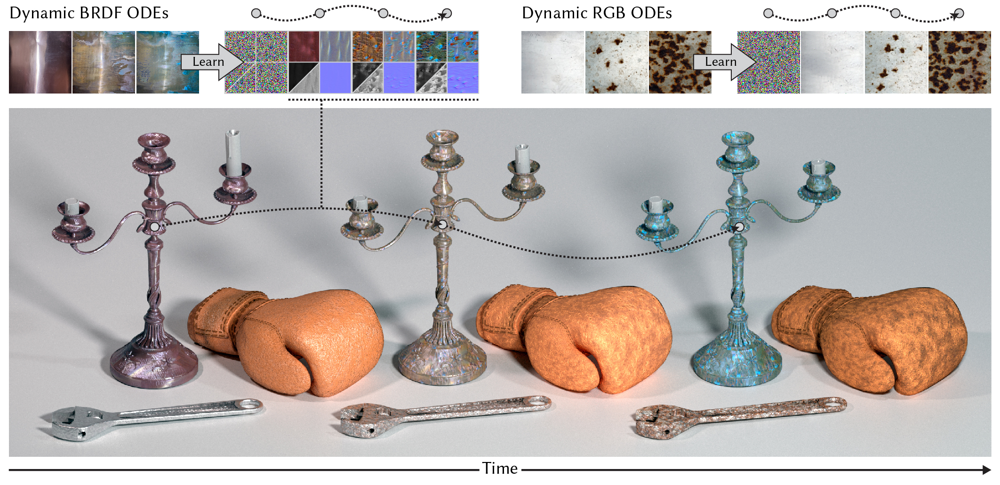

# Neural Differential Appearance Equations

> by [Chen Liu](https://ryushinn.github.io/) and [Tobias Ritschel](https://www.homepages.ucl.ac.uk/~ucactri/)
>
> _Transactions on Graphics (SIGGRAPH Asia 2024)_
>
> Please also check out our ([Paper](https://arxiv.org/pdf/2410.07128) | [Project Page](https://ryushinn.github.io/ode-appearance))

This repo provides the official implementation in JAX for our paper, and our dataset.

<!-- ## PyTorch Notebook -->

<!-- While the main implementation is in JAX, we have a Jupyter notebook with a minimal example of our method written in PyTorch, here. -->



## Setup

Our dependencies can be installed by

```bash
# recommended installing in a new virtual env with python 3.10, like conda
pip install -r requirements.txt
```

- We mainly require these packages: `jax`, `diffrax`, `equinox`, and `optax`.
- We also need `torch` (cpu) to load pre-trained VGG weights in `.pth` format.
- We use `tensorboard` to log our training
- (Optional) Please also install `ffmpeg` for inference code to generate `.avi` and `.mp4` outputs

Tested in Ubuntu 22.04.4 x64 and NVIDIA RTX4090 GPU with CUDA 12.

## Data

Please download our dataset [here](data/README.md), and extract `RGB_dynamic_textures.zip` to `data/RGB_dynamic_textures` and `SVBRDF_dynamic_flash_textures.zip` to `data/SVBRDF_dynamic_flash_textures`.

The folder structure should look like:

```bash
data
├── README.md
├── RGB_dynamic_textures
│   ├── changingcolor_leaves2.gif
│   ├── changingcolor_leaves.gif
│   ├── ...
│   └── vapouring_ice.gif
└── SVBRDF_dynamic_flash_textures
    ├── cheese_melting
    │   ├── IMG_0794.JPG
    │   ├── ...
    ├── clay_solidifying
    ├── ...
    └── watercolor_painting
```

## Usages

### Start with trained weights

You can download pre-trained weights [here](https://drive.google.com/file/d/10pjNWawgkpZOla_c4ljNGXy9Z7rh85h5/view?usp=sharing). Results reported in the paper can be reproduced with these weights.

To use these weights, please unzip the file in the root folder of this repo and run the inference scripts below.

### Training from scratch

```bash
# to train with dynamic textures
bash scripts/odetexture.sh data/RGB_dynamic_textures experiments_texture
# to train with dynamic flash textures
bash scripts/odeBRDF.sh data/SVBRDF_dynamic_flash_textures experiments_svbrdf
# to visualize your training logs by tensorboard
tensorboard --logdir experiments_texture
```

### Inference

```bash
# to sample with trained dynamic texture ODEs
bash scripts/sample_odetexture.sh data/RGB_dynamic_textures experiments_texture
# to sample with trained dynamic BRDF ODEs
bash scripts/sample_odeBRDF.sh data/SVBRDF_dynamic_flash_textures experiments_svbrdf
```

Sampled results are in `experiments_xxx` folders.

## Citation

Please cite our paper if you use the code or data.

```bibtex
@article{liuNeuralDifferentialAppearance2024,
  title={Neural Differential Appearance Equations},
  author={Liu, Chen and Ritschel, Tobias},
  journal={ACM Transactions on Graphics},
  volume={43},
  number={6},
  pages={1--17},
  year={2024},
  doi={10.1145/3687900},
}
```
