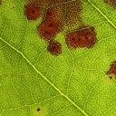
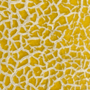
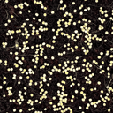
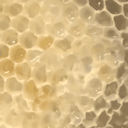
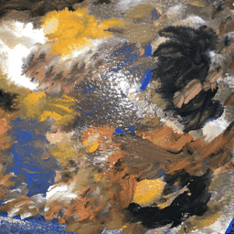

# Dynamic Appearance Dataset

We release a dataset of time-varying appearance such as rusting, drying, melting, molding, etc.

|  |  |            |      |            |    |
| ----------------------------------------------------------- | ----------------------------------------------------------- | --------------------------------------------------------- | ----------------------------------------------------- | ------------------------------------------------------- | ----------------------------------------------- |
|        |          |  |  |  |  |

## Download

| Links                                                                            | Description                                                                                                           | Size   |
| -------------------------------------------------------------------------------- | --------------------------------------------------------------------------------------------------------------------- | ------ |
| [RGB_dynamic_textures](https://figshare.com/s/1d54dad8e0e659259ed9)              | 22 dynamic textures with time-varying visual statistics; Each is 5s GIF;                                              | 2.2G   |
| [SVBRDF_dynamic_flash_textures](https://figshare.com/s/27eca8094c148021bf63)     | 21 flash-lit videos of time-varying materials; each has 100 JPG frames that are equally-spaced sampled from raw data; | 12.8G  |
| [RGB_dynamic_textures_raw](https://figshare.com/s/5b81379b5c563c13a7f2)          | Raw data for dynamic textures                                                                                         | 7.4G   |
| [SVBRDF_dynamic_flash_textures_raw](https://figshare.com/s/438b9971ba0ab902e1e0) | Raw data for flash-lit videos, including raw photographs for captured data and Blender scenes for synthetic data      | 118.3G |

To run our codebase, please donwload the first two ready-to-use datasets.

## Capture Setup

For those interested in capturing flash-lit time-lapse videos on their own, our setup is lightweight and accessible, requiring only:

1. A (programmable) camera with a flashlight close to the lens (co-located). Typically, your smartphone will suffice. For iPhone, we recommend using the [CameraPixels](https://camerapixels.app/) app;
2. A tripod to stabilize the camera;
3. An optical cover to block unwanted ambient lighting;
4. Your time-varying materials of interest. We provide [some protocols](#sources) to reproduce the materials we captured.

Check out our paper for more details.

## License

CC-BY-4.0

## Contact

This dataset is maintained by Chen Liu (<chen.liu.21@ucl.ac.uk>).

Please feel free to reach out if you find any errors or inappropriate usages.

## Cite

If you use this dataset please cite our paper:

```bibtex
@article{liuNeuralDifferentialAppearance2024,
  title={Neural Differential Appearance Equations},
  author={Liu, Chen and Ritschel, Tobias},
  journal={ACM Transactions on Graphics (Proceedings of SIGGRAPH Asia)},
  year={2024},
}
```

## Sources

For dynamic RGB textures all sources are listed below:

| Dynamic RGB Textures  | Sources                                                                    |
| --------------------- | -------------------------------------------------------------------------- |
| enlarging_bubbles     | Modified from [here](https://www.robots.ox.ac.uk/~vgg/data/dtd/index.html) |
| melting_honey         | YouTube ID: R4U0QV_ud4M                                                    |
| molding_bread         | YouTube ID: xIOOXh6t68c                                                    |
| growing_sprouts       | YouTube ID: \_kB-2Ex-0w8                                                   |
| crystallizing_salt    | YouTube ID: OBJDjE1Beuo                                                    |
| growing_beans         | YouTube ID: \_kB-2Ex-0w8                                                   |
| growing_roots         | YouTube ID: \_kB-2Ex-0w8                                                   |
| growing_grassroots    | YouTube ID: mNHEZ8By_7c                                                    |
| moving_clouds         | YouTube ID: ZyCCWuO0mQo                                                    |
| freezing_water        | YouTube ID: GlI_BPnlL_E                                                    |
| freezing_bubble       | YouTube ID: Wqk_CKSxlyU                                                    |
| rusting_steel         | YouTube ID: VHRoGHOu7N0                                                    |
| vapouring_ice         | YouTube ID: hkf13Nr4DB8                                                    |
| changingcolor_leaves  | YouTube ID: -dfmha1SJck                                                    |
| changingcolor_leaves2 | YouTube ID: -dfmha1SJck                                                    |
| frosting_drops        | YouTube ID: 0bbLvHw1cNQ                                                    |
| crystallizing_sodium  | YouTube ID: lo0cp2uhxb0                                                    |
| crystallizing_copper  | YouTube ID: lo0cp2uhxb0                                                    |
| growing_bacteria      | YouTube ID: j3qcSfdFPU4                                                    |
| cracking_clay         | YouTube ID: E7p17mlJV_o                                                    |
| dehydrating_radish    | YouTube ID: yu0yInmzSig                                                    |
| decaying_melon        | Captured by us from 2023 Oct 7 to Nov 13                                   |

For dynamic flash textures, we capture all in real world except seven synthetic data created in Blender using free resources in [BlenderKit](https://www.blenderkit.com/). Original Blender scenes can be found in the raw data.

We provide some reference instructions to reproduce our captured phenomena.
These instructions are mainly descriptive references without precise procedures.
They indicate the types of temporally varying physical properties included in our dataset: surface bumps, metallicity, wetness, and temperature.

|       Material | Process       |  Duration  | Instructions                                                                                                                                                                                                                                                    |
| -------------: | :------------ | :--------: | --------------------------------------------------------------------------------------------------------------------------------------------------------------------------------------------------------------------------------------------------------------- |
|          Paper | Drying        |  8 hours   | Attach paper to metal plate, spray with water, and let it dry.                                                                                                                                                                                                  |
|            Ice | Melting       |  3 hours   | Spray water onto a black acrylic container, freeze in a fridge, and let it melt at room temperature.                                                                                                                                                            |
|           Salt | Crystallizing |  24 hours  | Boil water, incrementally add more salt and stir till saturated. Filter using filter paper. Transfer the solution to a wide dark container. Cover from dust.                                                                                                    |
| Copper-sulfate | Crystallizing |  24 hours  | Same as above, just with copper sulfate.                                                                                                                                                                                                                        |
|      Honeycomb | Melting       | 30 minutes | Place honeycomb in a pot, fix using cookware, and heat.                                                                                                                                                                                                         |
|     Watercolor | Painting      | 30 minutes | Scribble five colors on paper, mix them for stationarity, and let it dry.                                                                                                                                                                                       |
|           Clay | Solidifying   |  3 hours   | Mix clay soil with water, spread on an acrylic sheet, and Let it dry.                                                                                                                                                                                           |
|         Copper | Patinating    |  8 hours   | Soak a copper plate in vinegar and salt for 2 minutes. Put the plate over tissue, and cover it with another tissue to dry out excess drops. Put it into a container. Pour the solution of vinegar and salt around the plate. For oxygen, do not soak the plate. |
|          Steak | Cooking       | 30 minutes | Wrap a piece of steak with foil, place it on top of a heater, and keep around 100℃. Use a fan to avoid overheating the capture device.                                                                                                                          |
|         Cheese | Melting       | 30 minutes | Same as above but keep around 80℃ for cheese.                                                                                                                                                                                                                   |
|          Cress | Germinating   |   5 days   | Soak cress seeds with water for hours. Pour them evenly into a container lined with a thick layer of tissue. Add sufficient water to keep the tissue moist for the next five days, and replenish when needed. Place the container around room temperature.      |

## Acknowledgment

We are grateful to persons who release their materials public, based on which we build up our dataset.
